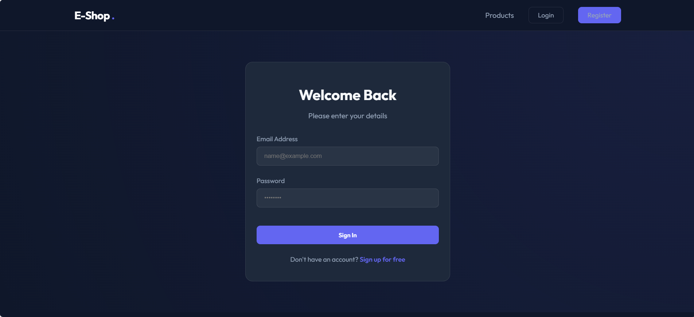

# Premium E-Commerce Management System

A full-stack e-commerce application built with **ASP.NET Core Web API** and **Angular**. This project features a modern, high-performance architecture with a premium dark-mode UI, designed for a professional portfolio.

## 🚀 Features
- **Modern UI:** Premium glassmorphism design using the Outfit font.
- **JWT Authentication:** Secure login and registration using JSON Web Tokens.
- **Reactive Cart:** Real-time shopping cart management using RxJS.
- **Product Catalog:** Dynamic product listing with category filtering.
- **Secure Backend:** Password hashing with BCrypt and a robust SQL Server database.
- **Swagger Documentation:** Interactive API documentation with JWT support.

## 🛠️ Tech Stack
- **Frontend:** Angular 19+, CSS3 (Custom Design System), RxJS.
- **Backend:** .NET 8, Entity Framework Core, SQL Server.
- **Security:** JWT, BCrypt.net.

## 📦 Getting Started

### Prerequisites
- .NET 8.0 SDK
- Node.js & Angular CLI
- SQL Server

### Backend Setup
1. Navigate to the `Server` folder.
2. Update `appsettings.json` with your SQL Server connection string.
3. Run `dotnet run` to start the API and seed the database.

### Frontend Setup
1. Navigate to the `Client` folder.
2. Run `npm install` to install dependencies.
3. Run `ng serve` and open `http://localhost:4200`.

## 📸 Screenshots

## 📄 License
This project is licensed under the MIT License.
