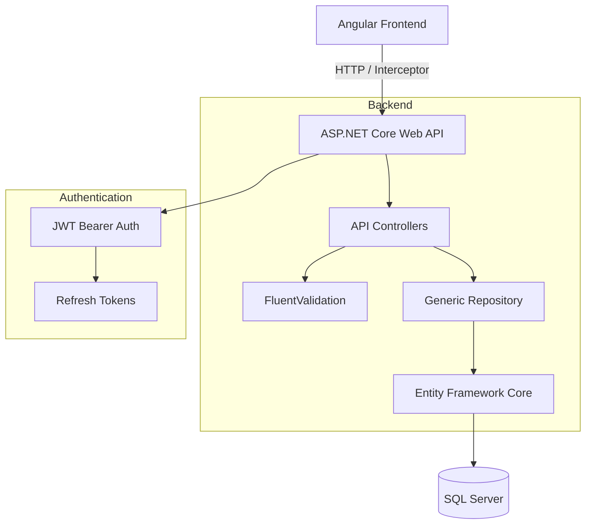

# E-Commerce Management System

A production-ready full-stack e-commerce application built with **ASP.NET Core Web API** and **Angular**. This project features a modern, high-performance architecture, designed with scalability and best practices in mind.

## 🚀 Features
- **Modern UI:** Premium design with Angular 19+ and RxJS.
- **Advanced JWT Authentication:** Secure login with JSON Web Tokens and Refresh Tokens.
- **Scalable Architecture:** Generic Repository Pattern implementation.
- **Robust Validation:** Backend validation using FluentValidation and Reactive Forms in the Frontend.
- **Swagger Documentation:** Interactive API documentation with JWT support.

## 🛠️ Tech Stack
- **Frontend:** Angular 19+, TypeScript, RxJS, HTML/CSS.
- **Backend:** .NET 8, ASP.NET Core Web API, Entity Framework Core, C#.
- **Database:** SQL Server.
- **Security:** JWT Authentication, BCrypt.net.
- **Validation:** FluentValidation (Backend), Reactive Forms (Frontend).

## 🗄️ Database Schema

The system uses a relational database schema optimized for e-commerce.

- **Users:** Stores user credentials, hashed passwords, and refresh tokens.
- **Products:** Contains product details, pricing, stock, and foreign key to Categories.
- **Categories:** Represents product groupings.
- **CartItems:** Links a User to a Product with an associated quantity.

## 🏗️ Architecture Diagram

```mermaid
graph TD
    Client[Angular Frontend] -->|HTTP / Interceptor| API[ASP.NET Core Web API]
    
    subgraph Backend
        API --> Controllers[API Controllers]
        Controllers --> FluentVal[FluentValidation]
        Controllers --> Repository[Generic Repository]
        Repository --> EF[Entity Framework Core]
    end
    
    EF --> Database[(SQL Server)]
    
    subgraph Authentication
        API --> JWT[JWT Bearer Auth]
        JWT --> Refresh[Refresh Tokens]
    end
```

## 📦 Getting Started

### Prerequisites
- .NET 8.0 SDK
- Node.js & Angular CLI
- SQL Server

### Backend Setup
1. Navigate to the `Server` folder: `cd Server`
2. Update `appsettings.json` with your SQL Server connection string.
3. Apply Entity Framework migrations (if applicable): `dotnet ef database update`
4. Run the API: `dotnet run` (Starts on `http://localhost:5266` or similar, depending on launchSettings.json).

### Frontend Setup
1. Navigate to the `Client` folder: `cd Client`
2. Run `npm install` to install dependencies.
3. Run `ng serve` to launch the Angular development server.
4. Open `http://localhost:4200` in your browser.

## 📄 License
This project is licensed under the MIT License.
